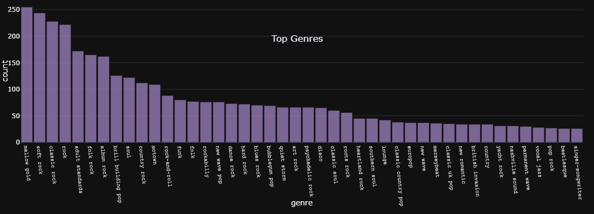

# mcgill-bb-to-spotify-playlist
Generate a Spotify playlist from a csv with columns of track names and artist names. 
Designed specifically to explore and contextualize the [McGill Billboard Corpus](https://ddmal.music.mcgill.ca/research/The_McGill_Billboard_Project_(Chord_Analysis_Dataset)/).

## Some results
* [**Spotify Playlist**](https://open.spotify.com/playlist/2whWrl00XDSf1omDLkjBDV) of 691 songs from the McGill Corpus.
* **data/mcgill-bb-playlist.html** some basic playlist analysis from Spotify metadata. To view the **.html** analysis file, you can either:
	1. **Clone** this repo, *or...*
	2. [**Save linked page**](https://raw.githubusercontent.com/tgj505/mcgill-bb-to-spotify-playlist/main/data/mcgill-bb-playlist.html) as an **.html** file, then open in-browser for plots and summaries of artist genres, track popularity, dates, and "acoustic features", *or...*
	3. Download directly from [**Dropbox**](https://www.dropbox.com/s/l6ikkalnj0v1fu8/mcgill-bb-playlist.html?dl=0).
* **data/mcgill-bb-playlist-metadata.pickle**. Pickled dataframe of Spotify metadata for each track. 

### Top Spotify Musician Genres in McGill Corpus

### *Spotify Metadata Analysis*

You can read in the **pickle** as a dict object in Python using: 
	
	from config.config import load_playlist_pickle
	
Contains relevant Spotify metadata like album, artist, genre, popularity, etc. 
for each track, as well as Spotify's ["audio features"](https://spotipy.readthedocs.io/en/2.17.1/#spotipy.client.Spotify.audio_features) metadata.

*N.B.* The dates in the playlist analysis often don't match the original album date since the search function often returns remastered versions, re-releases, and compilations.

## Replicate Playlist Generation
### Requirements
* `pandas`
* `spotipy`
* `pathlib`
* `datetime`
* `os`
* `pickle`

### Set up `config/config.py`!
Set this up with your **Spotify API credentials**, your **Spotify Username**, etc. to be able to write playlist.

Check the pathing as necessary; **set root directory** variable. I'm still learning pathing, apologies. 

### Run `playlist-build_mcgill2spotify.py`
1. Reads in the `data/mcgill_billboard_index.csv`.
2. Queries the `spotipy` API to get the track and musician URIs.
3. Creates a playlist.

It will open a browser tab to ask you to log in to your Spotify account. 

## Some basic data
Top 40 songs as measured by Spotify popularity March 7, 2021. 

	<table border="1" class="dataframe data">
  <thead>
    <tr style="text-align: right;">
      <th></th>
      <th>track_name</th>
      <th>first_artist</th>
      <th>track_popularity</th>
      <th>genre_count</th>
      <th>artist_genres</th>
    </tr>
  </thead>
  <tbody>
    <tr>
      <th>0</th>
      <td>Sweet Home Alabama</td>
      <td>Lynyrd Skynyrd</td>
      <td>81</td>
      <td>9</td>
      <td>[rock, country rock, southern rock, classic rock, blues rock, mellow gold, album rock, soft rock, hard rock]</td>
    </tr>
    <tr>
      <th>1</th>
      <td>Wake Me Up Before You Go-Go</td>
      <td>Wham!</td>
      <td>79</td>
      <td>4</td>
      <td>[new wave pop, dance rock, europop, new romantic]</td>
    </tr>
    <tr>
      <th>2</th>
      <td>With Or Without You - Remastered</td>
      <td>U2</td>
      <td>79</td>
      <td>3</td>
      <td>[irish rock, permanent wave, rock]</td>
    </tr>
    <tr>
      <th>3</th>
      <td>September</td>
      <td>Earth, Wind &amp; Fire</td>
      <td>79</td>
      <td>6</td>
      <td>[quiet storm, jazz funk, motown, soul, disco, funk]</td>
    </tr>
    <tr>
      <th>4</th>
      <td>Beat It</td>
      <td>Michael Jackson</td>
      <td>78</td>
      <td>3</td>
      <td>[r&amp;b, soul, pop]</td>
    </tr>
    <tr>
      <th>5</th>
      <td>Come Together - Remastered 2009</td>
      <td>The Beatles</td>
      <td>78</td>
      <td>6</td>
      <td>[rock, british invasion, beatlesque, classic rock, merseybeat, psychedelic rock]</td>
    </tr>
    <tr>
      <th>6</th>
      <td>Come and Get Your Love - Single Version</td>
      <td>Redbone</td>
      <td>77</td>
      <td>2</td>
      <td>[native american contemporary, native american]</td>
    </tr>
    <tr>
      <th>7</th>
      <td>Bad Moon Rising</td>
      <td>Creedence Clearwater Revival</td>
      <td>77</td>
      <td>7</td>
      <td>[rock, country rock, southern rock, classic rock, album rock, swamp rock, roots rock]</td>
    </tr>
    <tr>
      <th>8</th>
      <td>Mrs. Robinson - From "The Graduate" Soundtrack</td>
      <td>Simon &amp; Garfunkel</td>
      <td>75</td>
      <td>6</td>
      <td>[rock, mellow gold, classic rock, folk rock, folk, melancholia]</td>
    </tr>
    <tr>
      <th>9</th>
      <td>The Joker</td>
      <td>Steve Miller Band</td>
      <td>75</td>
      <td>12</td>
      <td>[rock, country rock, psychedelic rock, folk rock, classic rock, blues rock, album rock, mellow gold, soft rock, hard rock, roots rock, heartland rock]</td>
    </tr>
    <tr>
      <th>10</th>
      <td>Lovely Day</td>
      <td>Bill Withers</td>
      <td>75</td>
      <td>4</td>
      <td>[quiet storm, funk, motown, soul]</td>
    </tr>
    <tr>
      <th>11</th>
      <td>You Can Call Me Al</td>
      <td>Paul Simon</td>
      <td>75</td>
      <td>9</td>
      <td>[rock, singer-songwriter, permanent wave, classic rock, folk rock, mellow gold, folk, soft rock, roots rock]</td>
    </tr>
    <tr>
      <th>12</th>
      <td>La Grange - 2005 Remaster</td>
      <td>ZZ Top</td>
      <td>75</td>
      <td>7</td>
      <td>[rock, country rock, classic rock, blues rock, album rock, metal, hard rock]</td>
    </tr>
    <tr>
      <th>13</th>
      <td>Easy</td>
      <td>Commodores</td>
      <td>75</td>
      <td>8</td>
      <td>[quiet storm, mellow gold, motown, soul, disco, adult standards, soft rock, funk]</td>
    </tr>
    <tr>
      <th>14</th>
      <td>What's Love Got to Do with It</td>
      <td>Tina Turner</td>
      <td>75</td>
      <td>4</td>
      <td>[new wave pop, europop, soft rock, disco]</td>
    </tr>
    <tr>
      <th>15</th>
      <td>(Sittin' On) the Dock of the Bay</td>
      <td>Otis Redding</td>
      <td>74</td>
      <td>7</td>
      <td>[soul blues, classic soul, memphis soul, southern soul, soul, adult standards, funk]</td>
    </tr>
    <tr>
      <th>16</th>
      <td>Maniac</td>
      <td>Michael Sembello</td>
      <td>74</td>
      <td>1</td>
      <td>[hi-nrg]</td>
    </tr>
    <tr>
      <th>17</th>
      <td>Maneater</td>
      <td>Daryl Hall &amp; John Oates</td>
      <td>74</td>
      <td>6</td>
      <td>[rock, yacht rock, mellow gold, classic rock, album rock, soft rock]</td>
    </tr>
    <tr>
      <th>18</th>
      <td>Brandy (You're a Fine Girl)</td>
      <td>Looking Glass</td>
      <td>73</td>
      <td>2</td>
      <td>[soft rock, sunshine pop]</td>
    </tr>
    <tr>
      <th>19</th>
      <td>Riders on the Storm</td>
      <td>The Doors</td>
      <td>73</td>
      <td>5</td>
      <td>[rock, acid rock, classic rock, album rock, psychedelic rock]</td>
    </tr>
    <tr>
      <th>20</th>
      <td>Old Time Rock &amp; Roll</td>
      <td>Bob Seger</td>
      <td>73</td>
      <td>11</td>
      <td>[detroit rock, rock, country rock, classic rock, blues rock, folk rock, album rock, mellow gold, soft rock, hard rock, heartland rock]</td>
    </tr>
    <tr>
      <th>21</th>
      <td>Every Little Thing She Does Is Magic</td>
      <td>The Police</td>
      <td>73</td>
      <td>9</td>
      <td>[art rock, dance rock, new wave, rock, mellow gold, classic rock, permanent wave, album rock, soft rock]</td>
    </tr>
    <tr>
      <th>22</th>
      <td>Cecilia</td>
      <td>Simon &amp; Garfunkel</td>
      <td>73</td>
      <td>6</td>
      <td>[rock, mellow gold, classic rock, folk rock, folk, melancholia]</td>
    </tr>
    <tr>
      <th>23</th>
      <td>Happy Together</td>
      <td>The Turtles</td>
      <td>73</td>
      <td>5</td>
      <td>[bubblegum pop, classic rock, folk rock, brill building pop, psychedelic rock]</td>
    </tr>
    <tr>
      <th>24</th>
      <td>Karma Chameleon - Remastered</td>
      <td>Culture Club</td>
      <td>73</td>
      <td>9</td>
      <td>[dance rock, new wave, new wave pop, mellow gold, europop, disco, soft rock, synthpop, new romantic]</td>
    </tr>
    <tr>
      <th>25</th>
      <td>Baby Can I Hold You</td>
      <td>Tracy Chapman</td>
      <td>73</td>
      <td>5</td>
      <td>[pop rock, singer-songwriter, lilith, folk, women's music]</td>
    </tr>
    <tr>
      <th>26</th>
      <td>Red Red Wine</td>
      <td>UB40</td>
      <td>73</td>
      <td>3</td>
      <td>[uk reggae, reggae fusion, reggae]</td>
    </tr>
    <tr>
      <th>27</th>
      <td>Space Oddity - 2015 Remaster</td>
      <td>David Bowie</td>
      <td>72</td>
      <td>7</td>
      <td>[art rock, dance rock, rock, glam rock, classic rock, permanent wave, album rock]</td>
    </tr>
    <tr>
      <th>28</th>
      <td>True - Single Edit</td>
      <td>Spandau Ballet</td>
      <td>72</td>
      <td>9</td>
      <td>[dance rock, sophisti-pop, new wave, new wave pop, mellow gold, europop, soft rock, synthpop, new romantic]</td>
    </tr>
    <tr>
      <th>29</th>
      <td>Rebel Yell</td>
      <td>Billy Idol</td>
      <td>72</td>
      <td>10</td>
      <td>[dance rock, new wave, rock, new wave pop, mellow gold, classic rock, album rock, soft rock, hard rock, new romantic]</td>
    </tr>
    <tr>
      <th>30</th>
      <td>Maggie May</td>
      <td>Rod Stewart</td>
      <td>72</td>
      <td>3</td>
      <td>[soft rock, mellow gold, adult standards]</td>
    </tr>
    <tr>
      <th>31</th>
      <td>Money</td>
      <td>Pink Floyd</td>
      <td>72</td>
      <td>7</td>
      <td>[art rock, progressive rock, rock, classic rock, album rock, symphonic rock, psychedelic rock]</td>
    </tr>
    <tr>
      <th>32</th>
      <td>Unchained Melody</td>
      <td>The Righteous Brothers</td>
      <td>72</td>
      <td>8</td>
      <td>[rock-and-roll, bubblegum pop, folk rock, mellow gold, motown, rockabilly, adult standards, brill building pop]</td>
    </tr>
    <tr>
      <th>33</th>
      <td>Annie's Song</td>
      <td>John Denver</td>
      <td>71</td>
      <td>6</td>
      <td>[classic country pop, folk rock, mellow gold, folk, soft rock, adult standards]</td>
    </tr>
    <tr>
      <th>34</th>
      <td>Wild Horses - 2009 Mix</td>
      <td>The Rolling Stones</td>
      <td>71</td>
      <td>3</td>
      <td>[british invasion, classic rock, rock]</td>
    </tr>
    <tr>
      <th>35</th>
      <td>Take A Chance On Me</td>
      <td>ABBA</td>
      <td>71</td>
      <td>2</td>
      <td>[europop, swedish pop]</td>
    </tr>
    <tr>
      <th>36</th>
      <td>Help! - Remastered 2009</td>
      <td>The Beatles</td>
      <td>71</td>
      <td>6</td>
      <td>[rock, british invasion, beatlesque, classic rock, merseybeat, psychedelic rock]</td>
    </tr>
    <tr>
      <th>37</th>
      <td>If I Could Turn Back Time</td>
      <td>Cher</td>
      <td>71</td>
      <td>4</td>
      <td>[dance pop, new wave pop, pop, hollywood]</td>
    </tr>
    <tr>
      <th>38</th>
      <td>Rich Girl</td>
      <td>Daryl Hall &amp; John Oates</td>
      <td>71</td>
      <td>6</td>
      <td>[rock, yacht rock, mellow gold, classic rock, album rock, soft rock]</td>
    </tr>
    <tr>
      <th>39</th>
      <td>Jessie's Girl</td>
      <td>Rick Springfield</td>
      <td>71</td>
      <td>10</td>
      <td>[dance rock, rock, pop rock, new wave pop, yacht rock, mellow gold, classic rock, album rock, soft rock, australian rock]</td>
    </tr>
    <tr>
      <th>40</th>
      <td>Goodbye Yellow Brick Road - Remastered 2014</td>
      <td>Elton John</td>
      <td>71</td>
      <td>4</td>
      <td>[soft rock, mellow gold, glam rock, piano rock]</td>
    </tr>  
  </tbody>
</table>

